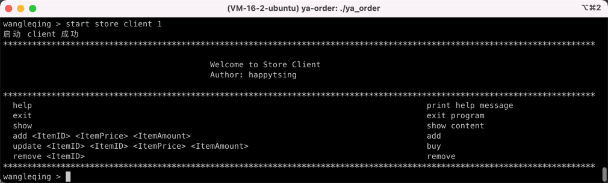

# YA-ORDER
课程设计：简单点餐系统

# QUICK START
```shell
cmake .
make
./ya_order
```
启动后界面如图所示：


首先启动服务端，此处共两个服务端，分别对应于5000端口和6000端口，服务端1为学生客户端1和商户客户端1服务，服务端2同理。

但是当其中一个服务端宕机时，另一个服务端会代替其相应服务。

学生客户端可以进行搜索和购买，如图：


商户客户端可以进行商品的搜索、新增、更新和删除，如图：

